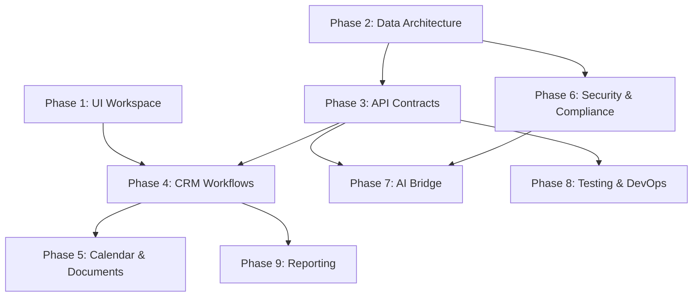

# Courtesy Implementation Roadmap

> **Scope**: Transform the Courtesy starter into a durable court-operations CRM.
> **Baseline**: Working starter with mock Flask backend (10 tests), React/TS/MUI frontend (clean build), and project harness (27/27 checks pass).
> **Rule**: No real court data, credentials, legal advice language, or silent AI behavior until explicitly authorized. `Courtesy Postgres Schema.md` is read-only source of truth.

---

## Schema Extension Policy

> [!CAUTION]
> The current PostgreSQL schema (`Courtesy Postgres Schema.md`) contains 17 tables and 1 view. It does **not** include tables for tasks, documents, notes, users, audit logs, or AI bridge history. This roadmap references all of those features, but referencing a feature is not permission to create new database tables.

**Rule**: Courtesy must not add app-owned tables to the production PostgreSQL database without explicit user approval. Until that approval is given:

| Feature | What is allowed now | What requires user approval |
| --- | --- | --- |
| Tasks | Mock fixtures, frontend-local state, in-memory backend storage | New `tasks` table via migration |
| Documents | Mock fixtures, metadata-only API, frontend-local state | New `documents` table via migration |
| Notes | Mock fixtures, frontend-local state, use of `cases.description` | New `case_notes` table via migration |
| Users / Auth | Mock users, hardcoded dev credentials, frontend-local auth state | New `users` table via migration |
| Audit Logs | Console/file logging, in-memory log buffer | New `audit_log` table via migration |
| AI Bridge History | Mock packet/artifact storage, frontend-local history | New `decision_prep_packets` / `decision_prep_artifacts` tables |

When a phase needs a new table, it must:
1. Propose the schema addition in a plan or doc (not silently create it).
2. Wait for the user to approve the specific table definition.
3. Add the table through a versioned Alembic migration, not raw DDL.
4. Leave `Courtesy Postgres Schema.md` unmodified — it documents the user's existing court database, not Courtesy's application tables.

Until approval, the feature works with mock fixtures, frontend-local state, or in-memory backend storage. This keeps every phase safe to execute without database side effects.

---

## Phase Overview



| Phase | Items | Depends On | Parallel With | Complexity |
| --- | --- | --- | --- | --- |
| 1 — UI Workspace | #1 | None | Phase 2 | Medium |
| 2 — Data Architecture | #2, #3, #4 | None | Phase 1 | High |
| 3 — API Contracts & Integration | #5, #6 | Phase 2 | — | Medium |
| 4 — Core CRM Workflows | #7, #8, #9 | Phases 1, 3 | — | High |
| 5 — Calendar, Timeline & Documents | #10, #11 | Phase 4 | — | Medium |
| 6 — Security, Audit & Data Sensitivity | #12, #13, #16 | Phase 2 | Phase 5 | High |
| 7 — AI_Tool Bridge | #14, #15 | Phases 3, 6 | — | Medium |
| 8 — Testing & DevOps | #17, #18, #19 | Phase 3 | Any phase | Medium |
| 9 — Reporting & Dashboards | #20 | Phase 4 | Phase 6+ | Medium |

> [!TIP]
> **Phases 1 and 2 can run in parallel** — Phase 1 is frontend-only and Phase 2 is backend-only. This is the fastest way to start.

---

## Phase 1 — UI Workspace Completion

**Items**: #1 (UI Workspace Completion)
**Layer**: Frontend only · Mock-first · No backend changes required

### Goal

Make the Courtesy workspace feel like a professional operations tool, not a prototype. The first screen remains the court workspace shell. All data stays mock until backend contracts are ready.

> [!IMPORTANT]
> Phase 1 is scoped to **workspace essentials only**. Advanced interactions, micro-animations, keyboard shortcuts, and deep quick-actions are deferred to a follow-up polish pass unless the user explicitly asks for them.

### Scope — Workspace Essentials

#### Responsive Shell
- Collapsible sidebar with active/hover states and section indicators
- Responsive breakpoints: full desktop (≥1280px), compact desktop (≥960px), tablet (≥600px), narrow fallback
- Persistent navigation state (selected section, sidebar collapsed/expanded) via local storage

#### State Handling
- **Loading states**: Skeleton screens for case list, detail panel, and data tables — no blank screens or spinners without context
- **Empty states**: Informative empty states with guidance ("No cases match your filter" with clear-filter action)
- **Error states**: Graceful degradation when backend is unavailable — show mock data with a clear "offline" indicator
- **Partial states**: Handle cases with missing hearings, no tasks, no documents — each section shows its own empty state

#### Case Detail Tabs / Sections
- Tabbed or sectioned detail view: Overview, Hearings, Tasks, Documents, Parties, Decision Prep
- Sticky header with case number and status badge
- Dense but scannable layout — operations users need information density, not whitespace

#### Filter & Sort Controls
- Debounced search input with clear button and result count
- Filter chips for status, case type, court, assigned judge
- Sort controls for case list (filing date, next hearing, case number, status)
- Preserved filter state across navigation

#### Task & Hearing Panel Polish
- Task panel: grouped by priority, sortable by due date, visual overdue indicators (red), upcoming (amber), complete (muted)
- Hearing panel: timeline layout with past/upcoming grouping, courtroom and judge info, result summary for completed hearings

#### Visual Foundation
- Consistent spacing system (4px/8px/16px/24px/32px grid)
- Status color system: Active (blue), Closed (gray), Pending (amber), Dismissed (muted), Settled (green)
- Typography hierarchy: clear distinction between labels, values, headings, and metadata
- Dark theme refinement: check contrast ratios, focus indicators, hover states

### Deferred to Follow-Up Polish (Not in Phase 1)

These items are valuable but not essential for the first implementation pass:

- Keyboard shortcuts for navigation
- Micro-animations (panel transitions, filter chip add/remove, skeleton shimmer)
- Copy-to-clipboard on case numbers, dates, and identifiers
- Breadcrumb trail for nested views
- Expandable/collapsible rows in task and hearing panels
- Quick-action buttons (mark complete, reschedule placeholder)
- Advanced quick actions in the case detail sticky header

These can be added in a focused polish pass after the workspace essentials are solid, or when the user explicitly requests them.

### Deliverables

| Deliverable | Acceptance |
| --- | --- |
| Responsive shell at 4 breakpoints | Sidebar collapses, panels reflow, no horizontal scroll |
| Loading/empty/error states for all panels | Every data section has all three states |
| Tabbed case detail view | Each tab renders with mock data or empty state |
| Filter/sort controls on case list | Filters persist across navigation |
| Task panel with priority grouping | Overdue items visually distinct |
| Hearing panel with past/upcoming split | Courtroom info visible |

### Acceptance Checks

- `npm run build` passes
- All panels render with mock data (manual browser check)
- Empty states render when mock data is filtered to zero
- Sidebar collapses and expands without layout break
- No console errors in browser dev tools

---

## Phase 2 — Backend Data Architecture

**Items**: #2 (PostgreSQL Schema Mapping), #3 (Database Connection Layer), #4 (Repository/Data Access Layer)
**Layer**: Backend only · No frontend changes

> [!IMPORTANT]
> Phase 2 builds models, config, session scaffolding, repository interfaces, and mock repository implementations. Actual SQLAlchemy-to-PostgreSQL query behavior is **not implemented** until `DATABASE_URL`, staging database access, and the schema extension policy (see above) are explicitly authorized by the user. Until then, the `DBRepository` classes are defined as stubs/interfaces, and all routes continue to use mock repositories.

### Goal

Build the data foundation so that routes can switch from mock fixtures to real PostgreSQL later without changing route logic. In this phase, only mock repositories are active. The repository pattern is the key: routes call repositories, repositories read from mock fixtures now and can read from SQLAlchemy sessions later.

### Scope

#### 2A — SQLAlchemy Model Mapping (Item #2)

Map every table from `Courtesy Postgres Schema.md` into SQLAlchemy 2.x declarative models:

| Model | Table | Key Relationships |
| --- | --- | --- |
| `Court` | `courts` | Has many judges, cases |
| `Judge` | `judges` | Belongs to court, has many cases |
| `CourtCaseType` | `court_case_type` | Referenced by cases |
| `CaseStatus` | `case_status` | Referenced by cases |
| `Case` | `cases` | Belongs to court, judge, type, status; has many parties, hearings, charges, payments, warrants |
| `Person` | `people` | Has many case parties |
| `CaseParty` | `case_parties` | Links case ↔ person with role |
| `Attorney` | `attorneys` | Standalone (FK relationships deferred until schema clarifies) |
| `Offense` | `offenses` | Referenced by charges |
| `Charge` | `charges` | Belongs to case + offense; has pleas, dispositions |
| `PleaType` | `plea_type` | Referenced by pleas |
| `Plea` | `pleas` | Belongs to charge + plea_type |
| `Disposition` | `dispositions` | Belongs to charge; has sentences |
| `Sentence` | `sentences` | Belongs to disposition |
| `Hearing` | `hearings` | Belongs to case |
| `Payment` | `payments` | Belongs to case |
| `Warrant` | `warrants` | Belongs to case |

**Rules**:
- Map columns exactly as documented — do not add, rename, or remove columns
- Do not create models for tables that do not exist in the schema (tasks, documents, notes, users, audit_log). See the Schema Extension Policy.
- Use SQLAlchemy 2.x `Mapped[]` / `mapped_column()` syntax
- Define all FK relationships with `relationship()` and `back_populates`
- Place models in `backend/app/models/` — one file per logical group (core, criminal, financial)
- Mark `vw_case_summary` as a read-only reflection or SQL expression, not a writable model
- These models define the mapping for a future DB connection. They do not create tables, run migrations, or attempt any database I/O in this phase.

#### 2B — Database Connection Scaffolding (Item #3)

- Add `DATABASE_URL` parsing from `.env` with validation
- Create `backend/app/database.py`: engine creation factory, session factory, session lifecycle pattern
- Connection pooling configuration: `pool_size=5`, `max_overflow=10`, `pool_timeout=30` (configurable via env)
- **Safe-by-default**: When `DATABASE_URL` is empty or missing, the app starts normally using mock fixtures. No connection attempt is made.
- Health endpoint (`/api/health`) reports database connectivity status when DB is configured, "not configured" otherwise
- `database.py` is importable but entirely inert without a `DATABASE_URL` — no engine created, no connection pooled, no session opened

> [!NOTE]
> This is scaffolding, not a live database connection. The engine, session factory, and lifecycle pattern are defined so that a future phase can activate them by setting `DATABASE_URL` and receiving user authorization. Until then, no database I/O occurs.

#### 2C — Repository / Data Access Layer (Item #4)

- Create `backend/app/repositories/` with repository interfaces and implementations per domain:
  - `CaseRepository` — list, get, filter, search
  - `HearingRepository` — list, filter by case, filter upcoming
  - `TaskRepository` — list, filter by priority/status/case
  - Additional repositories as needed (parties, charges, payments, warrants)
- **`MockRepository` implementations (active now)**: Read from current mock fixtures. These are the only implementations that execute in this phase.
- **`DBRepository` stubs (inactive)**: Define the interface and method signatures for future SQLAlchemy query implementations. Method bodies raise `NotImplementedError` or return empty results with a log warning. They are not wired into routes.
- Factory function selects `MockRepository` by default. It will select `DBRepository` only when `DATABASE_URL` is present **and** the user has authorized database access in a future phase.
- Routes refactored to call repositories instead of fixtures directly
- **Contract**: Repository methods return Pydantic models or plain dicts — not raw SQLAlchemy objects

### Deliverables

| Deliverable | Acceptance |
| --- | --- |
| SQLAlchemy models for all 17 schema tables | Models match schema exactly, relationships defined, no extra tables |
| `database.py` with connection scaffolding | Importable without DB, no connection attempt, no engine created |
| Mock repository implementations | Routes call mock repositories, not fixtures directly |
| DB repository stubs | Interface defined, methods raise NotImplementedError |
| Mock fallback preserved | All 10 existing tests still pass with no DB configured |

### Acceptance Checks

- `python -m pytest tests/ -v` — all existing tests pass (mock path)
- `python -c "from app.models import *"` — all models import without error
- `python -c "from app.database import get_engine"` — imports without creating an engine or attempting connection
- Mock repository tests pass
- No database connection is attempted during any test
- Harness check passes

---

## Phase 3 — API Contract Stabilization & Frontend Integration

**Items**: #5 (API Contract Stabilization), #6 (Frontend API Integration Cleanup)
**Layer**: Full stack · Depends on Phase 2

### Goal

Define stable, typed request/response shapes that both backend and frontend agree on. Eliminate type drift between Python and TypeScript.

### Scope

#### 3A — Backend API Contracts (Item #5)

Define Pydantic v2 schemas for every API response:

| Endpoint | Response Schema | Notes |
| --- | --- | --- |
| `GET /api/cases` | `list[CaseSummary]` | Compact list view |
| `GET /api/cases/:id` | `CaseDetail` | Full detail with nested hearings, tasks, parties, charges, documents |
| `GET /api/hearings` | `list[HearingSummary]` | Filterable by case, date range, upcoming |
| `GET /api/tasks` | `list[TaskSummary]` | Filterable by priority, status, case, assignee |
| `GET /api/parties` | `list[PartySummary]` | Filterable by case, role |
| `GET /api/charges` | `list[ChargeSummary]` | Filterable by case |
| `GET /api/dispositions` | `list[DispositionSummary]` | Filterable by charge, case |
| `GET /api/payments` | `list[PaymentSummary]` | Filterable by case |
| `GET /api/warrants` | `list[WarrantSummary]` | Filterable by case, active status |
| `GET /api/health` | `HealthStatus` | Includes DB connectivity |

- Place schemas in `backend/app/schemas/`
- Use Pydantic `model_config` with `from_attributes = True` for SQLAlchemy compatibility
- Add query parameter schemas for filter/sort/pagination
- Add pagination envelope: `{ items: [], total: int, page: int, page_size: int }`
- Generate a `contracts.json` or OpenAPI spec that frontend can reference

#### 3B — Frontend API Integration (Item #6)

- Regenerate `frontend/src/types/index.ts` to mirror backend Pydantic schemas exactly
- Update `courtApi.ts` to handle:
  - **Loading**: Return pending state while fetch is in-flight
  - **Empty**: Distinguish between "no results" and "not loaded"
  - **Error**: Capture HTTP status, backend error messages, network failures
  - **Unavailable backend**: Detect connection refused and fall back to mock data with visible indicator
  - **Pagination**: Support paginated responses
- Add a lightweight state management pattern (React context or custom hooks) for:
  - Case list with filters
  - Selected case detail
  - Active filter/sort state
  - Backend availability status

### Deliverables

| Deliverable | Acceptance |
| --- | --- |
| Pydantic schemas for all endpoints | Every route returns validated schema |
| Pagination envelope | Case list supports page/page_size params |
| Frontend types mirror backend | No hand-maintained type drift |
| Loading/error/empty handling in courtApi | All states visible in UI |
| Backend availability indicator | Mock fallback with visible "offline" badge |

### Acceptance Checks

- All backend tests pass
- Frontend builds cleanly
- New contract tests verify schema shapes
- Frontend renders mock data when backend is stopped

---

## Phase 4 — Core CRM Workflows

**Items**: #7 (Case Management Workflows), #8 (Search & Filtering), #9 (Task & Deadline Management)
**Layer**: Full stack · Depends on Phases 1, 3

### Goal

Make Courtesy feel like an actual work tool. Users should be able to find cases, review details, manage tasks, track deadlines, and navigate between related records efficiently.

### Scope

#### 4A — Case Management (Item #7)

- **Case list view**: Filterable, sortable, paginated grid with status badges, type labels, court/judge info, next hearing date, open task count
- **Case detail view**: Structured sections — Overview, Parties, Hearings, Charges/Dispositions, Tasks, Documents, Payments, Warrants, Notes, Decision Prep
- **Party display**: Show all case parties with roles (plaintiff, defendant, witness, attorney), link to person details
- **Charge/disposition display**: Show charges with offense details, severity, plea status, disposition results, sentences
- **Status changes**: UI for updating case status (mock-first — no write API until data layer supports it)
- **Notes**: Simple note-entry UI per case (stored in frontend state initially, backend model prepared)
- **Related cases**: If a person appears in multiple cases, show cross-references

#### 4B — Search & Filtering (Item #8)

- **Search bar**: Searches across case number, party names, judge name, court name, attorney name
- **Filter panel**: Combinable filters for status, case type, court, judge, date range (filing date, next hearing)
- **Backend query params**: `GET /api/cases?q=Smith&status=Active&case_type=Criminal&court_id=1&filed_after=2025-01-01&sort=filing_date&order=desc`
- **Saved filters**: Store filter presets in local storage (e.g., "My Active Cases", "Upcoming Criminal Hearings")
- **Result counts**: Show total matches and active filter summary
- **Clear all**: One-click filter reset

#### 4C — Task & Deadline Management (Item #9)

- **Task model extension**: Add `created_by`, `assigned_to`, `completed_at`, `notes` fields to task fixtures/schema
- **Task CRUD**: Create, edit, complete, delete tasks via API
  - `POST /api/tasks` — create task
  - `PUT /api/tasks/:id` — update task
  - `PATCH /api/tasks/:id/complete` — mark complete
  - `DELETE /api/tasks/:id` — soft delete
- **Task views**:
  - Per-case task list in case detail
  - Global task dashboard: "My Tasks", "Overdue", "Due This Week", "Upcoming"
  - Kanban-style or list view toggle
- **Deadline alerts**: Visual indicators for overdue (red badge), due today (amber), due this week (blue)
- **Priority management**: Drag-to-reorder or manual priority setting (Critical, High, Medium, Low)

### Deliverables

| Deliverable | Acceptance |
| --- | --- |
| Full case detail with all sections | Every schema entity visible in case detail |
| Search across multiple fields | Results update as user types |
| Combinable filters with clear-all | Filters persist and combine correctly |
| Task CRUD API and UI | Create, edit, complete tasks from the UI |
| Global task dashboard | Overdue/upcoming grouping works |
| Deadline visual indicators | Color-coded by urgency |

### Acceptance Checks

- All backend tests pass (existing + new task CRUD tests)
- Frontend builds cleanly
- Search returns correct filtered results
- Task create → edit → complete → verify cycle works end-to-end
- Case detail shows all related entities

---

## Phase 5 — Calendar, Timeline & Document Strategy

**Items**: #10 (Hearing Calendar & Timeline), #11 (Document Metadata & File Strategy)
**Layer**: Full stack · Depends on Phase 4

### Goal

Add the operational views that court staff use daily: a calendar for hearing scheduling and a metadata framework for court documents. Actual file storage remains deferred.

### Scope

#### 5A — Hearing Calendar & Timeline (Item #10)

- **Calendar view**: Month/week/day views showing hearings, task deadlines, and key case events
  - Dense, operational layout — not a decorative Google Calendar clone
  - Color-coded by event type: hearing (blue), deadline (red/amber), filing (gray), milestone (green)
  - Click-to-navigate: clicking a hearing opens the case detail at the hearing section
- **Timeline view**: Per-case chronological timeline of all events (hearings, filings, status changes, task completions, payments)
  - Vertical timeline with date markers and event cards
  - Expandable cards with detail summaries
- **Hearing management**: View, filter, and (eventually) schedule hearings
  - Filter by court, judge, date range, case type
  - Show courtroom assignments and scheduling conflicts
- **Day view**: "Today's hearings" dashboard panel — what's happening right now

#### 5B — Document Metadata & File Strategy (Item #11)

- **Document model**: Define the data model for filings, exhibits, orders, motions, and attachments
  - Fields: `document_id`, `case_id`, `document_type`, `title`, `filed_date`, `filed_by`, `description`, `file_reference` (path/URL placeholder), `confidentiality_level`
  - Document types: Complaint, Answer, Motion, Order, Exhibit, Subpoena, Transcript, Correspondence
- **Document list UI**: Per-case document list with type icons, filed date, filed-by, and confidentiality badges
- **File storage strategy doc**: Define the approach for actual file storage (local filesystem, S3, court document management system integration) — document the decision, don't implement storage yet
- **Upload placeholder**: UI shows an upload zone with a "Coming Soon — File storage not yet configured" message
- **Document metadata API**: `GET /api/cases/:id/documents`, `POST /api/cases/:id/documents` (metadata only, no file upload)

### Deliverables

| Deliverable | Acceptance |
| --- | --- |
| Calendar view with month/week/day | Hearings and deadlines render on correct dates |
| Per-case event timeline | Chronological events with expandable cards |
| "Today's hearings" panel | Shows current day's hearings |
| Document data model and API | CRUD for document metadata |
| Document list in case detail | Documents display with type and date |
| File storage strategy document | Decision documented, not implemented |

### Acceptance Checks

- Calendar renders hearings from mock data on correct dates
- Timeline shows events in chronological order
- Document metadata CRUD tests pass
- Frontend builds cleanly
- No file upload actually stores files — placeholder only

---

## Phase 6 — Security, Audit & Data Sensitivity

**Items**: #12 (Authentication & Roles), #13 (Audit Logging), #16 (Data Sensitivity & Redaction)
**Layer**: Full stack · Depends on Phase 2 · Can parallel with Phase 5

### Goal

Add the security foundation required before connecting real court data. Authentication, audit trails, and sensitivity classification are prerequisites, not afterthoughts.

### Scope

#### 6A — Authentication & Roles (Item #12)

- **Auth model**: `users` table with `user_id`, `username`, `email`, `password_hash`, `role`, `is_active`, `created_at`, `last_login`
- **Roles**: `admin`, `clerk`, `attorney`, `readonly` — define permission boundaries per role
  - `admin`: Full access including user management and audit log review
  - `clerk`: Case CRUD, task management, document management, hearing management
  - `attorney`: Read cases/hearings/documents assigned to them, limited task management
  - `readonly`: View-only access to non-sensitive fields
- **Login flow**: JWT-based authentication
  - `POST /api/auth/login` — returns access token + refresh token
  - `POST /api/auth/refresh` — refresh expired access token
  - `GET /api/auth/me` — return current user profile
  - `POST /api/auth/logout` — invalidate refresh token
- **Route protection**: Decorator/middleware that checks JWT and role before route execution
- **Frontend auth**: Login screen, token storage (httpOnly cookie preferred, localStorage fallback), auth context, protected routes
- **Least-privilege defaults**: New users get `readonly` by default. Role escalation requires `admin` approval.

#### 6B — Audit Logging (Item #13)

- **Audit model**: `audit_log` table with `log_id`, `user_id`, `action`, `entity_type`, `entity_id`, `details` (JSON), `ip_address`, `timestamp`
- **Tracked actions**: Case views, case updates, task changes, document access, data exports, AI packet submissions, login/logout, role changes, failed auth attempts
- **Backend middleware**: Auto-log sensitive route access
- **Audit API**: `GET /api/audit?entity_type=case&entity_id=1&action=update` — admin-only
- **Audit UI**: Admin panel showing recent activity, filterable by user, action type, entity, and date range
- **Retention policy**: Document how long audit logs should be kept (defer implementation of cleanup)

#### 6C — Data Sensitivity & Redaction (Item #16)

- **Sensitivity classification**: Tag fields by sensitivity level
  - **Public**: Case number, case type, court, filing date, hearing dates
  - **Restricted**: Party names, attorney names, judge assignments
  - **Confidential**: Date of birth, SSN last four, charges, dispositions, warrants, sentencing details
  - **Sealed**: Any case marked as sealed — entire record restricted
- **Redaction rules**:
  - API responses include a `sensitivity_level` field per entity
  - Confidential fields masked for `readonly` and `attorney` roles (e.g., DOB → `****-**-15`, SSN → `*1234`)
  - Sealed cases hidden entirely from non-admin users
  - Exports strip confidential fields unless user has explicit export permission
- **AI packet preparation**: Decision-prep packets must exclude confidential fields by default; user must explicitly opt-in to include sensitive data with a visible consent step
- **Frontend masking**: Components that display sensitive fields respect the sensitivity level returned by the API

### Deliverables

| Deliverable | Acceptance |
| --- | --- |
| JWT authentication flow | Login, token refresh, protected routes |
| Role-based access control | 4 roles with distinct permissions |
| Audit log for sensitive actions | Case views, updates, and exports logged |
| Audit admin panel | Admin can filter and review logs |
| Sensitivity classification | Fields tagged by level |
| Redaction rules | Confidential fields masked per role |
| Export redaction | Exports strip sensitive data by default |

### Acceptance Checks

- Login → access protected route → logout cycle works
- Unauthenticated requests return 401
- Wrong-role requests return 403
- Audit log records case view and update events
- Confidential fields masked for `readonly` role
- Sealed cases hidden from non-admin users
- All existing tests still pass (with test auth bypass)

---

## Phase 7 — AI_Tool Decision-Prep Bridge

**Items**: #14 (AI_Tool Bridge Contract), #15 (AI Decision-Prep UI)
**Layer**: Full stack · Depends on Phases 3, 6

### Goal

Define and implement the controlled, consent-driven interface for sending court case data to AI_Tool Decision Intelligence and receiving draft preparation aids back. Every output is labeled as a draft research aid, never legal advice.

### Scope

#### 7A — Bridge Contract (Item #14)

- **Decision-prep packet schema** (Pydantic):
  ```
  DecisionPrepPacket:
    packet_type: "decision_prep"
    case_id: str
    case_metadata: CaseMetadata
    selected_facts: list[str]           # User-selected, not auto-extracted
    source_references: list[SourceRef]   # Filings, hearings, documents
    tasks: list[TaskRef]                 # Relevant pending tasks
    user_notes: str                      # Free-text user context
    sensitivity_declaration: str         # User's explicit statement about data inclusion
    excluded_fields: list[str]           # Fields user chose NOT to include
  ```
- **Decision-support artifact schema**:
  ```
  DecisionSupportArtifact:
    artifact_type: "decision_support"
    case_id: str
    label: "DRAFT RESEARCH AID — NOT LEGAL ADVICE"
    analysis: AnalysisResult
    generated_at: datetime
    requires_user_approval: true
    expiration: datetime                 # Artifacts expire after configured period
  ```
- **Bridge API**:
  - `POST /api/decision-prep/packets` — submit packet (requires explicit user confirmation)
  - `GET /api/decision-prep/packets/:id` — review submitted packet
  - `GET /api/decision-prep/artifacts/:id` — retrieve returned artifact
  - `GET /api/decision-prep/history` — list past packet/artifact pairs
- **Security**: All bridge calls require `clerk` or `admin` role, audit logged, and user consent recorded
- **Mock mode**: Bridge always returns mock artifacts until AI_Tool integration is authorized

#### 7B — Decision-Prep UI (Item #15)

- **Packet builder**: Multi-step form for assembling a decision-prep packet
  - Step 1: Select case and review case metadata
  - Step 2: Select facts, hearings, and source references to include
  - Step 3: Select tasks and documents to include
  - Step 4: Add user notes and context
  - Step 5: Review sensitivity declaration — show exactly what data will be sent
  - Step 6: Explicit consent confirmation with "I understand this sends case data to an external AI service"
- **Data boundary display**: Visual diff showing what's included vs. excluded, with confidential fields highlighted
- **Artifact display**: Show returned analysis with prominent "DRAFT RESEARCH AID" label, evidence gaps, suggested next steps, and a "Dismiss / Save to Case" action
- **History view**: Past submissions with timestamps, case references, and artifact status

### Deliverables

| Deliverable | Acceptance |
| --- | --- |
| Pydantic packet/artifact schemas | Types match integration.md draft |
| Bridge API endpoints (mock mode) | Submit packet → receive mock artifact |
| Consent-driven packet builder UI | 6-step flow with explicit consent |
| Sensitivity display | User sees exactly what data is included |
| Artifact display with draft labels | Every output labeled as draft research aid |
| Bridge audit trail | All submissions and retrievals logged |

### Acceptance Checks

- Packet submission requires explicit consent click
- Mock artifact returned with correct label
- Confidential fields excluded by default in packet
- Audit log records packet submission and artifact retrieval
- UI prominently displays "DRAFT RESEARCH AID — NOT LEGAL ADVICE"
- No real AI_Tool connection made (mock mode only)

---

## Phase 8 — Testing, Harness & Deployment

**Items**: #17 (Testing Expansion), #18 (Dev Experience & Harness Hardening), #19 (Deployment Preparation)
**Layer**: Cross-cutting · Can start after Phase 3 · Grows with each subsequent phase

### Goal

Build the quality and operational infrastructure that keeps Courtesy stable as it grows. This phase is intentionally ongoing — each prior phase should add its own tests, but this phase fills gaps and adds cross-cutting checks.

### Scope

#### 8A — Testing Expansion (Item #17)

- **Backend repository tests**: Test mock and DB repository implementations separately
- **Contract tests**: Verify API responses match Pydantic schemas
- **Auth tests**: Login, token refresh, role enforcement, audit logging
- **Sensitivity tests**: Verify redaction rules per role
- **Frontend component tests**: React Testing Library tests for key components (CaseList, CaseDetail, TaskPanel, SearchBar, LoginForm)
- **Mock fallback tests**: Verify app works correctly when backend is unavailable
- **Integration tests**: Test full request cycle (auth → route → repository → response schema)
- **Regression suite**: Sensitive data rules, schema protection, API contract shapes

#### 8B — Harness Hardening (Item #18)

- **Schema drift check**: Verify SQLAlchemy models still match `Courtesy Postgres Schema.md`
- **Type drift check**: Verify frontend TypeScript types match backend Pydantic schemas (compare generated contracts)
- **Secret leakage scan**: Expand patterns for JWT secrets, database URLs, API keys in tracked files
- **Build health check**: Verify both `npm run build` and `python -m pytest` pass as part of harness
- **Doc completeness check**: Verify new features have corresponding documentation
- **Add checks to `courtesy_harness_check.py`** as features land — keep the script growing with the project

#### 8C — Deployment Preparation (Item #19)

- **Environment configuration**:
  - Local: `.env` with mock defaults, no DB required
  - Staging: `.env.staging` template with DB, limited CORS, debug logging
  - Production: `.env.production` template with strict CORS, no debug, structured logging
- **Production config**: `gunicorn` configuration, worker count, timeout settings
- **CORS rules**: Whitelist specific origins per environment — no `*` in production
- **Secret handling**: Document secret management approach (environment variables, not files in repo)
- **Logging**: Structured JSON logging for production, human-readable for development
- **Health checks**: `/api/health` reports app version, DB status, uptime, and dependency health
- **Deployment docs**: `docs/deployment.md` — step-by-step for local, staging, and production
- **Docker**: `Dockerfile` for backend, `Dockerfile` for frontend static build (optional — document the decision)

### Deliverables

| Deliverable | Acceptance |
| --- | --- |
| Backend test suite ≥ 40 tests | Repositories, contracts, auth, sensitivity |
| Frontend component tests ≥ 10 | Key components covered |
| Harness check ≥ 35 checks | Schema drift, type drift, secrets, build health |
| Environment templates | local, staging, production configs documented |
| Deployment docs | Step-by-step for each environment |
| Production health endpoint | Reports version, DB status, uptime |

### Acceptance Checks

- Full test suite passes
- Harness check passes with expanded checks
- Deployment docs are complete and accurate
- Production config template has no real credentials
- Health endpoint returns structured status

---

## Phase 9 — Reporting & Dashboards

**Items**: #20 (Reporting & Dashboards)
**Layer**: Full stack · Depends on Phase 4 · Should follow Phase 6 for role-based access

### Goal

Add operational reporting that helps court staff understand workload, identify bottlenecks, and track key metrics. This is the "manager view" of the CRM.

### Scope

#### Dashboard Panels

- **Case summary**: Open cases by status (Active, Pending, Dismissed, Settled, Closed) — bar or donut chart
- **Case type distribution**: Criminal vs. Civil vs. Family vs. Traffic — breakdown chart
- **Upcoming hearings**: Next 7/14/30 days with court and judge breakdown
- **Overdue tasks**: Count and list, grouped by priority and age
- **Workload by assignee**: Task count per user, grouped by status (open, overdue, completed this week)
- **Payment summary**: Total payments by case, payment method distribution, outstanding balances
- **Warrant activity**: Active warrants count, recently issued, recently resolved
- **Case aging**: Average time from filing to disposition, cases open > 90/180/365 days

#### Reporting API

- `GET /api/reports/case-summary` — aggregated case counts by status and type
- `GET /api/reports/hearings-upcoming?days=14` — upcoming hearing counts and details
- `GET /api/reports/tasks-overdue` — overdue task summary
- `GET /api/reports/workload?assignee=all` — task distribution by assignee
- `GET /api/reports/payments?case_id=&period=30d` — payment aggregations
- `GET /api/reports/warrants-active` — active warrant summary
- `GET /api/reports/case-aging` — case duration statistics

#### Dashboard UI

- **Dashboard view**: New top-level navigation item — "Dashboard" alongside Cases, Hearings, Tasks
- **Card-based layout**: Each report is a card with a chart/summary and a "View Details" link
- **Date range selector**: Filter all dashboard panels by time period
- **Auto-refresh**: Dashboard refreshes on a configurable interval (default: 5 minutes)
- **Export**: Download dashboard data as CSV or PDF (redacted per role)
- **Role-based visibility**: Some panels restricted by role (payment details → clerk/admin only)

### Deliverables

| Deliverable | Acceptance |
| --- | --- |
| 8 reporting API endpoints | Each returns aggregated data |
| Dashboard view with chart cards | All 8 panels render with mock data |
| Date range filtering | All panels respect selected period |
| Export to CSV | Dashboard data downloadable |
| Role-based panel visibility | Sensitive panels hidden for readonly users |

### Acceptance Checks

- Reporting endpoints return correct aggregations from mock data
- Dashboard renders all panels without errors
- Date range filter changes visible data
- CSV export excludes sensitive fields for restricted roles
- Frontend builds cleanly

---

## Cross-Cutting Rules (All Phases)

> [!IMPORTANT]
> These rules apply to every phase. Violating them is a blocking issue regardless of phase progress.

1. **No real court data** — All data is fictional mock data until the user explicitly authorizes real data connection.
2. **No real credentials** — `.env` is gitignored. Templates use placeholder values only.
3. **No schema modifications** — `Courtesy Postgres Schema.md` is read-only. Models map to it, they don't change it.
4. **No new database tables without approval** — The schema extension policy (above) governs when Courtesy may add app-owned tables. Until approved, features use mock fixtures or frontend-local state.
5. **No legal advice language** — All AI features labeled "draft preparation aid". No predictions, guarantees, or autonomous decisions.
6. **No silent AI/data sharing** — Every data transmission requires explicit user consent.
7. **Verification ladder** — Every phase ends with: backend tests pass, frontend builds, harness check passes, `git diff --check` passes.
8. **Mock-first** — New features work with mock data before requiring database or external services.
9. **Existing behavior preserved** — The workspace shell remains the first screen. Backend remains operational without a database.
10. **No live database I/O without authorization** — `DATABASE_URL` scaffolding exists but no engine is created, no session is opened, and no query is executed until the user explicitly authorizes database access.

---

## Open Questions

> [!IMPORTANT]
> These decisions should be made before or during the relevant phase. They don't block Phase 1 or 2.

1. **Schema extension approval**: When should Courtesy be allowed to add its own tables (tasks, documents, notes, users, audit_log) via Alembic migrations? This is the single most important gating question — it affects Phases 4, 5, 6, and 7. Until answered, those features stay mock/local.

2. **Task model**: The current PostgreSQL schema doesn't have a `tasks` table. Should tasks be a new Courtesy-owned table, or should they be mapped to an existing concept in the schema? This affects Phases 2 and 4.

3. **Document model**: Similarly, the schema doesn't have a `documents` table. Should this be a new table? This affects Phases 2 and 5.

4. **Notes model**: Should case notes be a new table, or should they use the `description` field on the `cases` table? This affects Phase 4.

5. **Authentication provider**: JWT self-managed, or integrate with an external auth provider (Auth0, Keycloak, etc.)? This affects Phase 6.

6. **File storage**: Local filesystem, S3-compatible object storage, or integration with a court document management system? This affects Phase 5 (strategy only — implementation deferred).

7. **Deployment target**: Docker containers, cloud platform (AWS/GCP/Azure), or bare metal? This affects Phase 8.

8. **Chart library**: For Phase 9 dashboards — Recharts, Chart.js, Nivo, or MUI X Charts? Should align with the existing MUI design system.

9. **Phase parallelism**: Should I execute Phases 1 and 2 in parallel (using subagents), or sequentially? Parallel is faster but uses more resources.

10. **Database access authorization**: When should Courtesy be allowed to connect to the real PostgreSQL database? This gates the transition from mock repositories to DB repositories in Phase 2 and beyond.
